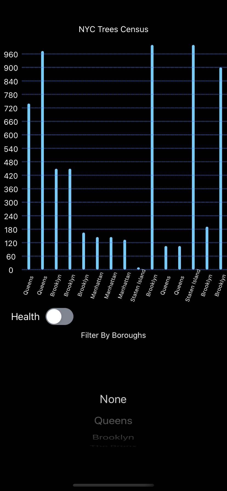
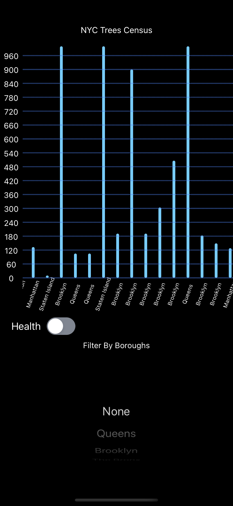
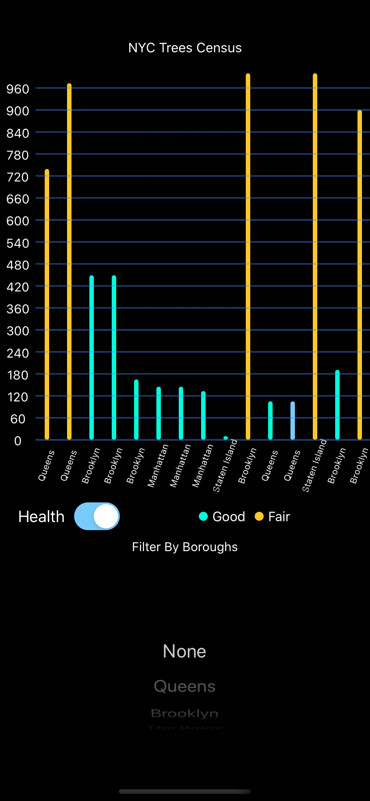
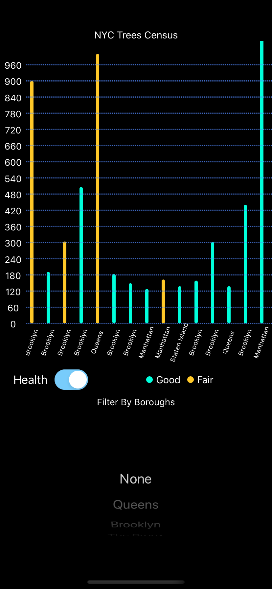
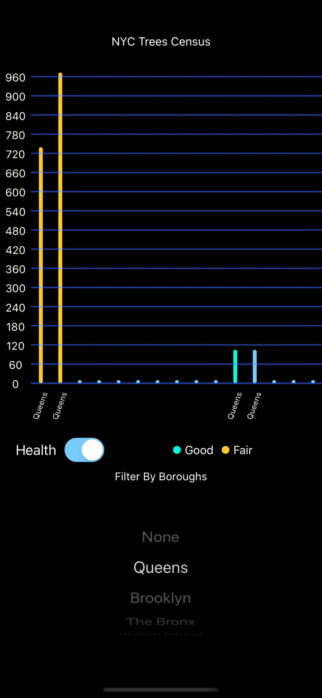
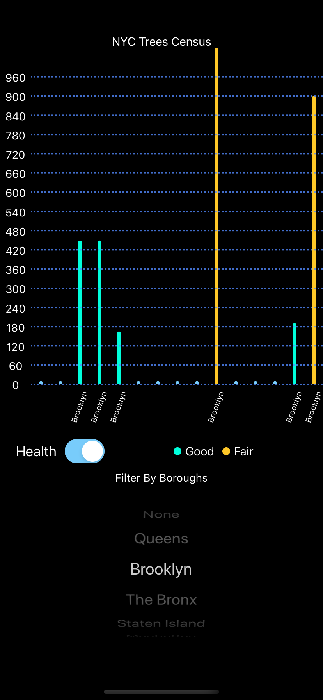

# NYC Tree Census 

<H2>Components</H2>
<H3>Built my Own custom Graph to display data</H3>
* Created dynamic graph from using svg
* Graph can scale depending on the data 
* Scrollable and interactive ( can toggle b/w the health of the tree and use filters ) 
 

<H3>Git Branching methodlogy</H3>
* Utilized proper git branch flow, master => feature/functionality => master
<H3>TypeChecking</H3>
* Used TypeScript for typechecking with a range of validators that can be used to make sure the data you receive is valid

<H1> Running </H1>
<b> Clone and Install </b>

* clone this repo `https://github.com/sourabhdadapure/YSProject.git`
* $ cd YSProject
* $ npm install
* $ react-native run-ios

<H1>Srcreenshots</H1>

